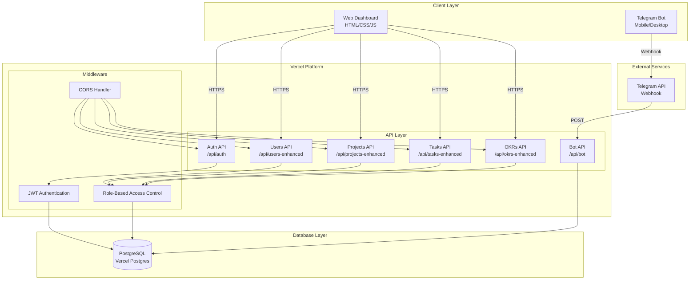
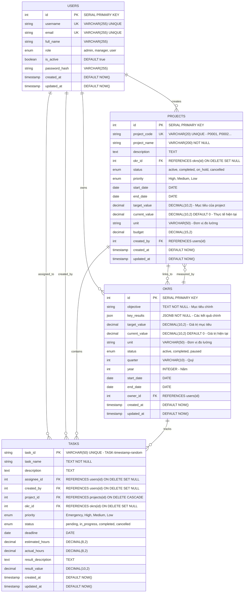

# System Design & Architecture

## Architecture Overview
**What is the high-level system structure?**

### System Architecture Diagram


### Key Components and Responsibilities
- **Web Dashboard**: Frontend interface cho quản lý projects, OKRs, tasks
- **Telegram Bot**: Mobile interface cho notifications và quick actions
- **API Layer**: RESTful APIs cho CRUD operations
- **Authentication**: JWT-based auth với role-based permissions
- **Database**: PostgreSQL cho data persistence
- **Vercel Platform**: Serverless hosting và auto-scaling

### Technology Stack
- **Frontend**: HTML5, CSS3, JavaScript (Vanilla), Tailwind CSS
- **Backend**: Node.js 18+, Express.js (Vercel Functions)
- **Database**: PostgreSQL (Vercel Postgres)
- **Authentication**: JWT + bcryptjs
- **Platform**: Vercel (Serverless)
- **External**: Telegram Bot API

## Data Models
**What data do we need to manage?**

### Core Entities and Relationships


### Entity Analysis

#### 1. **USERS Table** - Quản lý người dùng
**Mục đích**: Lưu trữ thông tin người dùng và phân quyền
**Key Fields**:
- `id`: Primary key tự tăng
- `username`: Tên đăng nhập duy nhất
- `email`: Email duy nhất
- `role`: Phân quyền (admin, manager, user)
- `is_active`: Trạng thái hoạt động

**Relationships**:
- **1:N với PROJECTS**: Một user có thể tạo nhiều projects
- **1:N với TASKS**: Một user có thể được assign nhiều tasks
- **1:N với OKRS**: Một user có thể sở hữu nhiều OKRs

#### 2. **PROJECTS Table** - Quản lý dự án
**Mục đích**: Lưu trữ thông tin dự án và liên kết với OKRs
**Key Fields**:
- `project_code`: Mã dự án tự động (P0001, P0002...)
- `okr_id`: Liên kết với OKR (có thể NULL)
- `target_value/current_value`: Mục tiêu và thực tế
- `unit`: Đơn vị đo lường (tự động sync từ OKR)

**Relationships**:
- **N:1 với OKRS**: Một project có thể link với một OKR
- **1:N với TASKS**: Một project chứa nhiều tasks
- **N:1 với USERS**: Một project được tạo bởi một user

#### 3. **OKRS Table** - Quản lý mục tiêu và kết quả chính
**Mục đích**: Lưu trữ OKRs và theo dõi tiến độ
**Key Fields**:
- `objective`: Mục tiêu chính
- `key_results`: JSON array các kết quả chính
- `target_value/current_value`: Giá trị mục tiêu và hiện tại
- `unit`: Đơn vị đo lường
- `quarter/year`: Quý và năm

**Relationships**:
- **1:N với PROJECTS**: Một OKR có thể có nhiều projects
- **1:N với TASKS**: Một OKR có thể track nhiều tasks
- **N:1 với USERS**: Một OKR thuộc về một user

#### 4. **TASKS Table** - Quản lý công việc cụ thể
**Mục đích**: Lưu trữ tasks và theo dõi tiến độ
**Key Fields**:
- `task_id`: ID duy nhất (TASK-timestamp-random)
- `project_id`: Liên kết với project
- `okr_id`: Liên kết với OKR (có thể NULL)
- `assignee_id`: Người được assign
- `priority`: Độ ưu tiên
- `estimated_hours/actual_hours`: Giờ ước tính và thực tế

**Relationships**:
- **N:1 với PROJECTS**: Một task thuộc về một project
- **N:1 với OKRS**: Một task có thể link với một OKR
- **N:1 với USERS (assignee)**: Một task được assign cho một user
- **N:1 với USERS (created_by)**: Một task được tạo bởi một user

### Business Rules & Constraints

#### 1. **Project Code Generation**
- Tự động tạo mã dự án: P0001, P0002, P0003...
- Format: P + 4 chữ số (zero-padded)
- Unique constraint đảm bảo không trùng lặp

#### 2. **Unit Synchronization**
- Khi project link với OKR → unit tự động lấy từ OKR
- Khi project không link OKR → cho phép chọn unit thủ công
- Đảm bảo consistency giữa OKR và Project

#### 3. **Role-Based Access Control**
- **Admin**: Full access tất cả entities
- **Manager**: CRUD Projects, OKRs, Tasks (không Users)
- **User**: Read Projects/OKRs, CRUD Tasks

#### 4. **Cascade Deletes**
- Xóa Project → Xóa tất cả Tasks liên quan
- Xóa User → Set NULL cho created_by, assignee_id
- Xóa OKR → Set NULL cho project.okr_id, task.okr_id

### Data Flow
1. **User Authentication**: Login → JWT Token → Role-based access
2. **Project Creation**: Admin/Manager → Auto-generate code → Link OKR → Set unit
3. **Task Assignment**: User → Select project/OKR → Set priority/deadline
4. **Progress Tracking**: Update values → Sync with OKRs → Notify via Telegram

### Performance Considerations
- **Indexes**: username, email, project_code, task_id
- **Foreign Keys**: Proper constraints với CASCADE/SET NULL
- **JSON Fields**: key_results sử dụng JSONB cho performance
- **Timestamps**: created_at, updated_at cho audit trail

### Data Model Validation ✅
**Đã xác nhận phù hợp với nhu cầu dự án:**
- ✅ **Quản lý dự án**: Projects với auto-generated codes (P0001, P0002...)
- ✅ **Theo dõi OKRs**: OKRs với progress tracking và unit synchronization
- ✅ **Phân công công việc**: Tasks với assignee và project linking
- ✅ **Phân quyền**: 3 levels (Admin, Manager, User) với RBAC
- ✅ **Đồng bộ đơn vị**: OKR ↔ Project unit sync tự động
- ✅ **Cascade operations**: Proper delete constraints và data integrity

## API Design
**How do components communicate?**

### External APIs
- **Telegram Bot API**: Webhook endpoint `/api/bot` cho real-time notifications
- **Telegram Webhook**: `https://api.telegram.org/bot{token}/setWebhook`

### Internal APIs
```
Authentication:
POST /api/auth/login
POST /api/auth/verify
POST /api/auth/change-password

Users Management:
GET /api/users-enhanced
POST /api/users-enhanced
PUT /api/users-enhanced/{id}
DELETE /api/users-enhanced/{id}

Projects Management:
GET /api/projects-enhanced/projects
POST /api/projects-enhanced/projects
PUT /api/projects-enhanced/projects/{id}
DELETE /api/projects-enhanced/projects/{id}

Tasks Management:
GET /api/tasks-enhanced/tasks
POST /api/tasks-enhanced/tasks
PUT /api/tasks-enhanced/tasks/{id}
DELETE /api/tasks-enhanced/tasks/{id}

OKRs Management:
GET /api/okrs-enhanced/okrs
POST /api/okrs-enhanced/okrs
PUT /api/okrs-enhanced/okrs/{id}
DELETE /api/okrs-enhanced/okrs/{id}
```

### Request/Response Formats
```json
// Login Request
{
  "username": "admin",
  "password": "password123"
}

// Login Response
{
  "token": "eyJhbGciOiJIUzI1NiIsInR5cCI6IkpXVCJ9...",
  "user": {
    "id": 1,
    "username": "admin",
    "role": "admin",
    "name": "Administrator"
  }
}

// Project Creation
{
  "project_name": "New Project",
  "description": "Project description",
  "okr_id": 1,
  "priority": "High",
  "status": "active",
  "start_date": "2025-01-01",
  "end_date": "2025-12-31",
  "target_value": "100",
  "unit": "%"
}
```

### Authentication/Authorization
- **JWT Tokens**: 24-hour expiration, refresh on activity
- **Role-Based Access**: Admin (full), Manager (projects/OKRs), User (tasks only)
- **Middleware**: `verifyToken`, `requireAdmin`, `requireAdminOrManager`

## Component Breakdown
**What are the major building blocks?**

### Frontend Components
- **Login Page** (`pages/login.html`): Authentication interface
- **Projects Dashboard** (`pages/projects-enhanced.html`): Project management
- **Tasks Dashboard** (`pages/tasks-enhanced.html`): Task management  
- **OKRs Dashboard** (`pages/okrs-enhanced.html`): OKR tracking
- **User Management** (`pages/users-management.html`): Admin user control

### Backend Services/Modules
- **Auth Service** (`api/auth-endpoint.js`): Login, verify, password change
- **Users Service** (`api/users-enhanced.js`): User CRUD operations
- **Projects Service** (`api/projects-enhanced.js`): Project management
- **Tasks Service** (`api/tasks-enhanced.js`): Task operations
- **OKRs Service** (`api/okrs-enhanced.js`): OKR tracking
- **Bot Service** (`api/bot.js`): Telegram webhook handler

### Database Layer
- **PostgreSQL**: Primary data store
- **Connection Pooling**: Managed by Vercel Postgres
- **Migrations**: Scripts in `/scripts/` directory

### Third-party Integrations
- **Telegram Bot API**: Real-time notifications
- **Vercel Platform**: Hosting và deployment
- **Vercel Postgres**: Database hosting

## Design Decisions
**Why did we choose this approach?**

### Key Architectural Decisions
1. **Serverless Architecture (Vercel)**
   - **Pros**: Auto-scaling, zero maintenance, cost-effective
   - **Cons**: Cold starts, vendor lock-in
   - **Rationale**: Perfect for MVP, easy deployment

2. **PostgreSQL over NoSQL**
   - **Pros**: ACID compliance, complex queries, relational data
   - **Cons**: More complex than MongoDB
   - **Rationale**: Need relational data (users, projects, tasks, OKRs)

3. **JWT over Session-based Auth**
   - **Pros**: Stateless, scalable, mobile-friendly
   - **Cons**: Harder to revoke tokens
   - **Rationale**: Serverless environment, multiple clients

4. **Role-Based Access Control**
   - **Pros**: Flexible permissions, easy to extend
   - **Cons**: More complex than simple auth
   - **Rationale**: Different user types need different access levels

### Alternatives Considered
- **Firebase**: Chosen Vercel for better Node.js support
- **MongoDB**: Chosen PostgreSQL for relational data needs
- **OAuth**: Chosen JWT for simplicity and control

### Patterns Applied
- **RESTful API Design**: Standard HTTP methods and status codes
- **Middleware Pattern**: Authentication, authorization, CORS
- **Repository Pattern**: Database abstraction layer
- **Factory Pattern**: Auto-generated project codes

## Non-Functional Requirements
**How should the system perform?**

### Performance Targets
- **API Response Time**: < 2 seconds
- **Database Queries**: < 500ms
- **Page Load Time**: < 3 seconds
- **Telegram Bot Response**: < 1 second

### Scalability Considerations
- **Auto-scaling**: Vercel handles traffic spikes automatically
- **Database**: Vercel Postgres scales with usage
- **Caching**: Browser caching for static assets
- **Connection Pooling**: Managed by Vercel Postgres

### Security Requirements
- **HTTPS Only**: All communications encrypted
- **JWT Security**: Signed tokens with expiration
- **Input Validation**: All inputs sanitized
- **SQL Injection Prevention**: Parameterized queries
- **CORS**: Configured for specific origins

### Reliability/Availability Needs
- **Uptime Target**: 99.9% (Vercel SLA)
- **Error Handling**: Graceful degradation
- **Logging**: Comprehensive error tracking
- **Monitoring**: Vercel built-in monitoring
- **Backup**: Vercel Postgres automated backups

