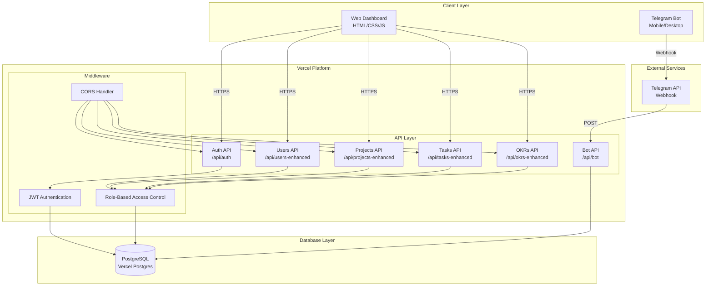
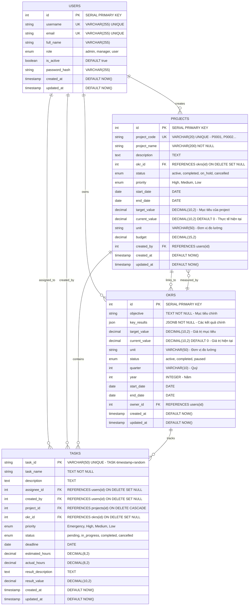

# System Design & Architecture

## Architecture Overview
**What is the high-level system structure?**

### System Architecture Diagram


### Key Components and Responsibilities
- **Web Dashboard**: Frontend interface cho quản lý projects, OKRs, tasks
- **Telegram Bot**: Mobile interface cho notifications và quick actions
- **API Layer**: RESTful APIs cho CRUD operations
- **Authentication**: JWT-based auth với role-based permissions
- **Database**: PostgreSQL cho data persistence
- **Vercel Platform**: Serverless hosting và auto-scaling

### Technology Stack
- **Frontend**: HTML5, CSS3, JavaScript (Vanilla), Tailwind CSS
- **Backend**: Node.js 18+, Express.js (Vercel Functions)
- **Database**: PostgreSQL (Vercel Postgres)
- **Authentication**: JWT + bcryptjs
- **Platform**: Vercel (Serverless)
- **External**: Telegram Bot API

### UI/UX Technology Stack (NEW)
- **Design System**: Custom design system với Tailwind CSS
- **Icons**: Font Awesome 6.0, Heroicons
- **Charts**: Chart.js, D3.js cho advanced visualizations
- **Animations**: CSS Transitions, Framer Motion (future)
- **Mobile**: PWA support, touch gestures
- **Real-time**: WebSocket cho live updates
- **State Management**: Vanilla JS với custom state manager

## Data Models
**What data do we need to manage?**

### Core Entities and Relationships


### Entity Analysis

#### 1. **USERS Table** - Quản lý người dùng
**Mục đích**: Lưu trữ thông tin người dùng và phân quyền
**Key Fields**:
- `id`: Primary key tự tăng
- `username`: Tên đăng nhập duy nhất
- `email`: Email duy nhất
- `role`: Phân quyền (admin, manager, user)
- `is_active`: Trạng thái hoạt động

**Relationships**:
- **1:N với PROJECTS**: Một user có thể tạo nhiều projects
- **1:N với TASKS**: Một user có thể được assign nhiều tasks
- **1:N với OKRS**: Một user có thể sở hữu nhiều OKRs

#### 2. **PROJECTS Table** - Quản lý dự án
**Mục đích**: Lưu trữ thông tin dự án và liên kết với OKRs
**Key Fields**:
- `project_code`: Mã dự án tự động (P0001, P0002...)
- `okr_id`: Liên kết với OKR (có thể NULL)
- `target_value/current_value`: Mục tiêu và thực tế
- `unit`: Đơn vị đo lường (tự động sync từ OKR)

**Relationships**:
- **N:1 với OKRS**: Một project có thể link với một OKR
- **1:N với TASKS**: Một project chứa nhiều tasks
- **N:1 với USERS**: Một project được tạo bởi một user

#### 3. **OKRS Table** - Quản lý mục tiêu và kết quả chính
**Mục đích**: Lưu trữ OKRs và theo dõi tiến độ
**Key Fields**:
- `objective`: Mục tiêu chính
- `key_results`: JSON array các kết quả chính
- `target_value/current_value`: Giá trị mục tiêu và hiện tại
- `unit`: Đơn vị đo lường
- `quarter/year`: Quý và năm

**Relationships**:
- **1:N với PROJECTS**: Một OKR có thể có nhiều projects
- **1:N với TASKS**: Một OKR có thể track nhiều tasks
- **N:1 với USERS**: Một OKR thuộc về một user

#### 4. **TASKS Table** - Quản lý công việc cụ thể
**Mục đích**: Lưu trữ tasks và theo dõi tiến độ
**Key Fields**:
- `task_id`: ID duy nhất (TASK-timestamp-random)
- `project_id`: Liên kết với project
- `okr_id`: Liên kết với OKR (có thể NULL)
- `assignee_id`: Người được assign
- `priority`: Độ ưu tiên
- `estimated_hours/actual_hours`: Giờ ước tính và thực tế

**Relationships**:
- **N:1 với PROJECTS**: Một task thuộc về một project
- **N:1 với OKRS**: Một task có thể link với một OKR
- **N:1 với USERS (assignee)**: Một task được assign cho một user
- **N:1 với USERS (created_by)**: Một task được tạo bởi một user

### Business Rules & Constraints

#### 1. **Project Code Generation**
- Tự động tạo mã dự án: P0001, P0002, P0003...
- Format: P + 4 chữ số (zero-padded)
- Unique constraint đảm bảo không trùng lặp

#### 2. **Unit Synchronization**
- Khi project link với OKR → unit tự động lấy từ OKR
- Khi project không link OKR → cho phép chọn unit thủ công
- Đảm bảo consistency giữa OKR và Project

#### 3. **Role-Based Access Control**
- **Admin**: Full access tất cả entities
- **Manager**: CRUD Projects, OKRs, Tasks (không Users)
- **User**: Read Projects/OKRs, CRUD Tasks

#### 4. **Cascade Deletes**
- Xóa Project → Xóa tất cả Tasks liên quan
- Xóa User → Set NULL cho created_by, assignee_id
- Xóa OKR → Set NULL cho project.okr_id, task.okr_id

### Data Flow
1. **User Authentication**: Login → JWT Token → Role-based access
2. **Project Creation**: Admin/Manager → Auto-generate code → Link OKR → Set unit
3. **Task Assignment**: User → Select project/OKR → Set priority/deadline
4. **Progress Tracking**: Update values → Sync with OKRs → Notify via Telegram

### Performance Considerations
- **Indexes**: username, email, project_code, task_id
- **Foreign Keys**: Proper constraints với CASCADE/SET NULL
- **JSON Fields**: key_results sử dụng JSONB cho performance
- **Timestamps**: created_at, updated_at cho audit trail

### Data Model Validation ✅
**Đã xác nhận phù hợp với nhu cầu dự án:**
- ✅ **Quản lý dự án**: Projects với auto-generated codes (P0001, P0002...)
- ✅ **Theo dõi OKRs**: OKRs với progress tracking và unit synchronization
- ✅ **Phân công công việc**: Tasks với assignee và project linking
- ✅ **Phân quyền**: 3 levels (Admin, Manager, User) với RBAC
- ✅ **Đồng bộ đơn vị**: OKR ↔ Project unit sync tự động
- ✅ **Cascade operations**: Proper delete constraints và data integrity

## API Design
**How do components communicate?**

### External APIs
- **Telegram Bot API**: Webhook endpoint `/api/bot` cho real-time notifications
- **Telegram Webhook**: `https://api.telegram.org/bot{token}/setWebhook`

### Internal APIs
```
Authentication:
POST /api/auth/login
POST /api/auth/verify
POST /api/auth/change-password

Users Management:
GET /api/users-enhanced
POST /api/users-enhanced
PUT /api/users-enhanced/{id}
DELETE /api/users-enhanced/{id}

Projects Management:
GET /api/projects-enhanced/projects
POST /api/projects-enhanced/projects
PUT /api/projects-enhanced/projects/{id}
DELETE /api/projects-enhanced/projects/{id}

Tasks Management:
GET /api/tasks-enhanced/tasks
POST /api/tasks-enhanced/tasks
PUT /api/tasks-enhanced/tasks/{id}
DELETE /api/tasks-enhanced/tasks/{id}

OKRs Management:
GET /api/okrs-enhanced/okrs
POST /api/okrs-enhanced/okrs
PUT /api/okrs-enhanced/okrs/{id}
DELETE /api/okrs-enhanced/okrs/{id}
```

### Request/Response Formats
```json
// Login Request
{
  "username": "admin",
  "password": "password123"
}

// Login Response
{
  "token": "eyJhbGciOiJIUzI1NiIsInR5cCI6IkpXVCJ9...",
  "user": {
    "id": 1,
    "username": "admin",
    "role": "admin",
    "name": "Administrator"
  }
}

// Project Creation
{
  "project_name": "New Project",
  "description": "Project description",
  "okr_id": 1,
  "priority": "High",
  "status": "active",
  "start_date": "2025-01-01",
  "end_date": "2025-12-31",
  "target_value": "100",
  "unit": "%"
}
```

### Authentication/Authorization
- **JWT Tokens**: 24-hour expiration, refresh on activity
- **Role-Based Access**: Admin (full), Manager (projects/OKRs), User (tasks only)
- **Middleware**: `verifyToken`, `requireAdmin`, `requireAdminOrManager`

## Component Breakdown
**What are the major building blocks?**

### Frontend Components
- **Login Page** (`pages/login.html`): Authentication interface
- **Projects Dashboard** (`pages/projects-enhanced.html`): Project management
- **Tasks Dashboard** (`pages/tasks-enhanced.html`): Task management  
- **OKRs Dashboard** (`pages/okrs-enhanced.html`): OKR tracking
- **User Management** (`pages/users-management.html`): Admin user control

### UI/UX Components (NEW)
- **Sidebar Navigation** (`components/sidebar.html`): Collapsible navigation
- **Kanban Board** (`components/kanban.html`): Drag & drop task management
- **Smart Dashboard** (`components/dashboard.html`): Interactive widgets
- **Mobile Bottom Nav** (`components/mobile-nav.html`): Mobile navigation
- **Notification System** (`components/notifications.html`): Toast, badges, alerts
- **Progress Rings** (`components/progress-rings.html`): OKR progress visualization
- **Task Cards** (`components/task-cards.html`): Interactive task cards
- **Project Cards** (`components/project-cards.html`): Project visualization
- **Real-time Updates** (`components/realtime.html`): Live collaboration

### Module-Specific UI/UX Components (NEW)

#### 👥 Users Management Components
- **User Card** (`components/users/user-card.html`): Rich user cards với avatar, stats
- **User Analytics** (`components/users/user-analytics.html`): User statistics dashboard
- **Role Badge** (`components/users/role-badge.html`): Color-coded role indicators
- **User Search** (`components/users/user-search.html`): Smart search với filters
- **Bulk Actions** (`components/users/bulk-actions.html`): Multi-select operations
- **Activity Timeline** (`components/users/activity-timeline.html`): User activity history

#### 🎯 OKRs Management Components
- **OKR Card** (`components/okrs/okr-card.html`): OKR cards với progress rings
- **Progress Ring** (`components/okrs/progress-ring.html`): Circular progress indicators
- **Key Results List** (`components/okrs/key-results.html`): KR visualization
- **Quarterly View** (`components/okrs/quarterly-view.html`): Timeline view
- **OKR Analytics** (`components/okrs/okr-analytics.html`): Performance charts
- **Project Links** (`components/okrs/project-links.html`): Visual project connections
- **OKR Detail Modal** (`components/okrs/okr-detail-modal.html`): Comprehensive OKR details
- **Related Projects** (`components/okrs/related-projects.html`): Linked projects display
- **Team Members** (`components/okrs/team-members.html`): OKR team overview
- **Risk Indicators** (`components/okrs/risk-indicators.html`): Warning system

#### 📁 Projects Management Components
- **Project Kanban** (`components/projects/project-kanban.html`): Drag & drop board
- **Project Card** (`components/projects/project-card.html`): Rich project cards
- **Timeline View** (`components/projects/timeline-view.html`): Gantt-style timeline
- **Health Metrics** (`components/projects/health-metrics.html`): Project health indicators
- **Team Assignment** (`components/projects/team-assignment.html`): Visual team assignment
- **Budget Tracking** (`components/projects/budget-tracking.html`): Budget progress bars
- **Project Detail Modal** (`components/projects/project-detail-modal.html`): Comprehensive project details
- **Related Tasks** (`components/projects/related-tasks.html`): Project tasks overview
- **Team Members** (`components/projects/team-members.html`): Project team with roles
- **Dependencies** (`components/projects/dependencies.html`): Project dependencies
- **Budget Analytics** (`components/projects/budget-analytics.html`): Financial tracking

#### ✅ Tasks Management Components
- **Task Kanban** (`components/tasks/task-kanban.html`): Multi-column task board
- **Task Card** (`components/tasks/task-card.html`): Rich task cards
- **Priority Indicator** (`components/tasks/priority-indicator.html`): Visual priority system
- **Assignee Avatar** (`components/tasks/assignee-avatar.html`): User avatar assignments
- **Deadline Alert** (`components/tasks/deadline-alert.html`): Deadline warnings
- **Time Tracker** (`components/tasks/time-tracker.html`): Built-in time tracking
- **Task Detail Modal** (`components/tasks/task-detail-modal.html`): Comprehensive task details
- **Dependencies** (`components/tasks/dependencies.html`): Task dependencies
- **Comments System** (`components/tasks/comments.html`): Task comments and notes
- **File Attachments** (`components/tasks/file-attachments.html`): File management
- **Time Tracking** (`components/tasks/time-tracking.html`): Hours tracking
- **Activity Log** (`components/tasks/activity-log.html`): Task history

### Backend Services/Modules
- **Auth Service** (`api/auth-endpoint.js`): Login, verify, password change
- **Users Service** (`api/users-enhanced.js`): User CRUD operations
- **Projects Service** (`api/projects-enhanced.js`): Project management
- **Tasks Service** (`api/tasks-enhanced.js`): Task operations
- **OKRs Service** (`api/okrs-enhanced.js`): OKR tracking
- **Bot Service** (`api/bot.js`): Telegram webhook handler

### Database Layer
- **PostgreSQL**: Primary data store
- **Connection Pooling**: Managed by Vercel Postgres
- **Migrations**: Scripts in `/scripts/` directory

### Third-party Integrations
- **Telegram Bot API**: Real-time notifications
- **Vercel Platform**: Hosting và deployment
- **Vercel Postgres**: Database hosting

## Design Decisions
**Why did we choose this approach?**

### Key Architectural Decisions
1. **Serverless Architecture (Vercel)**
   - **Pros**: Auto-scaling, zero maintenance, cost-effective
   - **Cons**: Cold starts, vendor lock-in
   - **Rationale**: Perfect for MVP, easy deployment

2. **PostgreSQL over NoSQL**
   - **Pros**: ACID compliance, complex queries, relational data
   - **Cons**: More complex than MongoDB
   - **Rationale**: Need relational data (users, projects, tasks, OKRs)

3. **JWT over Session-based Auth**
   - **Pros**: Stateless, scalable, mobile-friendly
   - **Cons**: Harder to revoke tokens
   - **Rationale**: Serverless environment, multiple clients

4. **Role-Based Access Control**
   - **Pros**: Flexible permissions, easy to extend
   - **Cons**: More complex than simple auth
   - **Rationale**: Different user types need different access levels

### Alternatives Considered
- **Firebase**: Chosen Vercel for better Node.js support
- **MongoDB**: Chosen PostgreSQL for relational data needs
- **OAuth**: Chosen JWT for simplicity and control

### Patterns Applied
- **RESTful API Design**: Standard HTTP methods and status codes
- **Middleware Pattern**: Authentication, authorization, CORS
- **Repository Pattern**: Database abstraction layer
- **Factory Pattern**: Auto-generated project codes

## Non-Functional Requirements
**How should the system perform?**

### Performance Targets
- **API Response Time**: < 2 seconds
- **Database Queries**: < 500ms
- **Page Load Time**: < 3 seconds
- **Telegram Bot Response**: < 1 second

### Scalability Considerations
- **Auto-scaling**: Vercel handles traffic spikes automatically
- **Database**: Vercel Postgres scales with usage
- **Caching**: Browser caching for static assets
- **Connection Pooling**: Managed by Vercel Postgres

### Security Requirements
- **HTTPS Only**: All communications encrypted
- **JWT Security**: Signed tokens with expiration
- **Input Validation**: All inputs sanitized
- **SQL Injection Prevention**: Parameterized queries
- **CORS**: Configured for specific origins

### Reliability/Availability Needs
- **Uptime Target**: 99.9% (Vercel SLA)
- **Error Handling**: Graceful degradation
- **Logging**: Comprehensive error tracking
- **Monitoring**: Vercel built-in monitoring
- **Backup**: Vercel Postgres automated backups

## UI/UX Design System (NEW)
**Modern, intuitive interface design**

### Design Principles
- **Mobile-First**: Thiết kế cho mobile trước, desktop sau
- **Progressive Enhancement**: Từ cơ bản đến nâng cao
- **Accessibility**: WCAG 2.1 compliance
- **Performance**: < 2s load time, smooth animations
- **Consistency**: Design system thống nhất

### Color Palette
```css
/* Primary Colors */
--primary-50: #eff6ff;
--primary-500: #3b82f6;
--primary-900: #1e3a8a;

/* Secondary Colors */
--secondary-50: #ecfdf5;
--secondary-500: #10b981;
--secondary-900: #064e3b;

/* Neutral Colors */
--gray-50: #f9fafb;
--gray-100: #f3f4f6;
--gray-500: #6b7280;
--gray-900: #111827;

/* Status Colors */
--success: #10b981;
--warning: #f59e0b;
--error: #ef4444;
--info: #3b82f6;
```

### Typography Scale
```css
/* Headings */
--text-3xl: 1.875rem; /* 30px */
--text-2xl: 1.5rem;   /* 24px */
--text-xl: 1.25rem;   /* 20px */

/* Body Text */
--text-base: 1rem;    /* 16px */
--text-sm: 0.875rem;  /* 14px */
--text-xs: 0.75rem;   /* 12px */
```

### Layout System
```css
/* Grid System */
--grid-cols-1: repeat(1, minmax(0, 1fr));
--grid-cols-2: repeat(2, minmax(0, 1fr));
--grid-cols-3: repeat(3, minmax(0, 1fr));
--grid-cols-4: repeat(4, minmax(0, 1fr));

/* Spacing Scale */
--space-1: 0.25rem;   /* 4px */
--space-2: 0.5rem;    /* 8px */
--space-4: 1rem;      /* 16px */
--space-6: 1.5rem;    /* 24px */
--space-8: 2rem;      /* 32px */
```

### Component Library
- **Buttons**: Primary, secondary, ghost, icon buttons
- **Cards**: Project cards, task cards, OKR cards
- **Forms**: Input fields, selects, textareas, checkboxes
- **Navigation**: Sidebar, mobile bottom nav, breadcrumbs
- **Charts**: Progress rings, bar charts, line charts
- **Modals**: Dialog, drawer, popover
- **Notifications**: Toast, badge, alert

### Responsive Breakpoints
```css
/* Mobile First */
sm: 640px   /* Mobile */
md: 768px   /* Tablet */
lg: 1024px  /* Desktop */
xl: 1280px  /* Large Desktop */
2xl: 1536px /* Extra Large */
```

### Animation System
- **Page Transitions**: Smooth fade in/out
- **Micro-interactions**: Hover, click, focus states
- **Loading States**: Skeleton screens, spinners
- **Scroll Animations**: Parallax, reveal effects
- **Drag & Drop**: Smooth transitions, visual feedback

### Module-Specific Design Patterns (NEW)

#### 👥 Users Management Design Patterns
```css
/* User Card Design */
.user-card {
  --user-primary: #8b5cf6;      /* Purple - User focus */
  --user-secondary: #06b6d4;    /* Cyan - Actions */
  --user-success: #10b981;      /* Green - Active */
  --user-warning: #f59e0b;      /* Amber - Inactive */
  --user-danger: #ef4444;       /* Red - Delete */
}

/* User Analytics Layout */
.analytics-grid {
  display: grid;
  grid-template-columns: repeat(auto-fit, minmax(300px, 1fr));
  gap: 1.5rem;
}

/* Role Badge System */
.role-badge {
  --admin: #ef4444;
  --manager: #3b82f6;
  --member: #10b981;
}
```

#### 🎯 OKRs Management Design Patterns
```css
/* OKR Card Design */
.okr-card {
  --okr-primary: #f97316;       /* Orange - OKR focus */
  --okr-secondary: #3b82f6;     /* Blue - Progress */
  --okr-success: #10b981;       /* Green - Achieved */
  --okr-warning: #f59e0b;       /* Amber - At Risk */
  --okr-danger: #ef4444;        /* Red - Dropped */
}

/* Progress Ring Animation */
.progress-ring {
  transition: stroke-dashoffset 0.3s ease;
  transform: rotate(-90deg);
}

/* Key Results Layout */
.key-results {
  display: flex;
  flex-direction: column;
  gap: 0.75rem;
}
```

#### 📁 Projects Management Design Patterns
```css
/* Project Card Design */
.project-card {
  --project-primary: #3b82f6;   /* Blue - Project focus */
  --project-secondary: #8b5cf6; /* Purple - Actions */
  --project-success: #10b981;   /* Green - Completed */
  --project-warning: #f59e0b;   /* Amber - In Progress */
  --project-danger: #ef4444;    /* Red - Cancelled */
}

/* Kanban Board Layout */
.kanban-board {
  display: grid;
  grid-template-columns: repeat(auto-fit, minmax(300px, 1fr));
  gap: 1rem;
  padding: 1rem;
}

/* Project Health Indicators */
.health-metric {
  --healthy: #10b981;
  --at-risk: #f59e0b;
  --critical: #ef4444;
}
```

#### ✅ Tasks Management Design Patterns
```css
/* Task Card Design */
.task-card {
  --task-primary: #f97316;      /* Orange - Task focus */
  --task-secondary: #06b6d4;    /* Cyan - Actions */
  --task-success: #10b981;      /* Green - Done */
  --task-warning: #f59e0b;      /* Amber - In Progress */
  --task-danger: #ef4444;       /* Red - Blocked */
}

/* Task Kanban Layout */
.task-kanban {
  display: grid;
  grid-template-columns: repeat(4, 1fr);
  gap: 1rem;
  min-height: 500px;
}

/* Priority Indicators */
.priority-indicator {
  --high: #ef4444;
  --medium: #f59e0b;
  --low: #10b981;
}
```

### Mobile-First Responsive Patterns (NEW)

#### Breakpoint Strategy
```css
/* Mobile First Approach */
@media (min-width: 320px) { /* Mobile S */ }
@media (min-width: 375px) { /* Mobile M */ }
@media (min-width: 425px) { /* Mobile L */ }
@media (min-width: 768px) { /* Tablet */ }
@media (min-width: 1024px) { /* Desktop */ }
@media (min-width: 1440px) { /* Large Desktop */ }
```

#### Touch Interactions
```css
/* Touch-friendly buttons */
.touch-button {
  min-height: 44px;
  min-width: 44px;
  padding: 0.75rem;
}

/* Swipe gestures */
.swipe-container {
  touch-action: pan-x;
  overflow-x: auto;
}

/* Long press interactions */
.long-press {
  touch-action: manipulation;
}
```

#### Mobile Navigation Patterns
```css
/* Hamburger Menu */
.hamburger-menu {
  position: fixed;
  top: 0;
  left: 0;
  width: 280px;
  height: 100vh;
  background: white;
  transform: translateX(-100%);
  transition: transform 0.3s ease;
  z-index: 1000;
}

.hamburger-menu.open {
  transform: translateX(0);
}

/* Swipe Gestures */
.swipe-container {
  touch-action: pan-x;
  overflow-x: auto;
  -webkit-overflow-scrolling: touch;
}

.swipe-item {
  transition: transform 0.3s ease;
}

.swipe-item.swiping {
  transform: translateX(var(--swipe-distance));
}

/* Pull to Refresh */
.pull-to-refresh {
  position: relative;
  overflow: hidden;
}

.refresh-indicator {
  position: absolute;
  top: -50px;
  left: 50%;
  transform: translateX(-50%);
  transition: top 0.3s ease;
}

.refresh-indicator.active {
  top: 20px;
}
```

### Mobile-Specific Features (NEW)

#### Camera Integration
```css
/* Camera Modal */
.camera-modal {
  position: fixed;
  top: 0;
  left: 0;
  width: 100%;
  height: 100%;
  background: black;
  z-index: 2000;
}

.camera-preview {
  width: 100%;
  height: 70%;
  object-fit: cover;
}

.camera-controls {
  position: absolute;
  bottom: 0;
  left: 0;
  right: 0;
  height: 30%;
  background: white;
  display: flex;
  align-items: center;
  justify-content: center;
  gap: 2rem;
}

/* File Attachment */
.file-attachment {
  display: flex;
  align-items: center;
  gap: 0.5rem;
  padding: 0.5rem;
  background: #f3f4f6;
  border-radius: 0.5rem;
  margin: 0.5rem 0;
}

.file-icon {
  width: 24px;
  height: 24px;
  color: #3b82f6;
}

.file-name {
  font-size: 0.875rem;
  color: #374151;
  text-decoration: none;
}

.file-name:hover {
  text-decoration: underline;
}
```

#### Voice Notes
```css
/* Voice Recording */
.voice-recorder {
  display: flex;
  align-items: center;
  gap: 1rem;
  padding: 1rem;
  background: #f9fafb;
  border-radius: 0.5rem;
  margin: 0.5rem 0;
}

.voice-button {
  width: 48px;
  height: 48px;
  border-radius: 50%;
  background: #ef4444;
  color: white;
  border: none;
  display: flex;
  align-items: center;
  justify-content: center;
  cursor: pointer;
  transition: all 0.2s ease;
}

.voice-button.recording {
  background: #dc2626;
  animation: pulse 1s infinite;
}

.voice-button:hover {
  transform: scale(1.05);
}

.voice-waveform {
  flex: 1;
  height: 40px;
  background: #e5e7eb;
  border-radius: 20px;
  position: relative;
  overflow: hidden;
}

.voice-wave {
  position: absolute;
  top: 50%;
  left: 0;
  width: 100%;
  height: 2px;
  background: #3b82f6;
  transform: translateY(-50%);
  animation: wave 1s ease-in-out infinite;
}

@keyframes pulse {
  0%, 100% { opacity: 1; }
  50% { opacity: 0.7; }
}

@keyframes wave {
  0%, 100% { transform: translateY(-50%) scaleX(0.3); }
  50% { transform: translateY(-50%) scaleX(1); }
}
```

#### Keyboard Shortcuts
```css
/* Shortcut Help Modal */
.shortcut-modal {
  position: fixed;
  top: 50%;
  left: 50%;
  transform: translate(-50%, -50%);
  background: white;
  border-radius: 0.5rem;
  box-shadow: 0 20px 25px -5px rgba(0, 0, 0, 0.1);
  z-index: 1500;
  max-width: 500px;
  width: 90%;
}

.shortcut-list {
  padding: 1.5rem;
}

.shortcut-item {
  display: flex;
  justify-content: space-between;
  align-items: center;
  padding: 0.75rem 0;
  border-bottom: 1px solid #e5e7eb;
}

.shortcut-key {
  background: #f3f4f6;
  padding: 0.25rem 0.5rem;
  border-radius: 0.25rem;
  font-family: monospace;
  font-size: 0.875rem;
  color: #374151;
}

.shortcut-description {
  color: #6b7280;
  font-size: 0.875rem;
}
```

