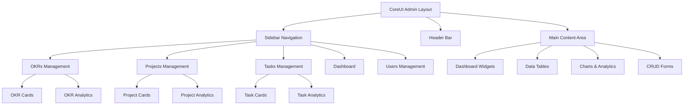

# CoreUI Admin Architecture Design

## System Architecture



## Component Structure

### 1. Layout Components
- **AppLayout**: Main wrapper with sidebar and header
- **Sidebar**: Navigation menu with icons
- **Header**: Top bar with user info and notifications
- **Breadcrumb**: Navigation breadcrumbs
- **Footer**: Optional footer component

### 2. Dashboard Components
- **StatsWidget**: Overview statistics cards
- **ChartWidget**: Progress and analytics charts
- **RecentActivity**: Latest updates feed
- **QuickActions**: Fast access buttons

### 3. Management Components
- **DataTable**: Enhanced tables with sorting, filtering
- **CardGrid**: Grid layout for items
- **Modal**: CRUD operation modals
- **Form**: Input forms with validation

### 4. UI Components
- **Button**: Consistent button styles
- **Input**: Form input components
- **Select**: Dropdown components
- **Badge**: Status indicators
- **Progress**: Progress bars and rings

## Design System

### Color Palette
- **Primary**: CoreUI Blue (#321fdb)
- **Secondary**: CoreUI Gray (#6c757d)
- **Success**: Green (#28a745)
- **Warning**: Orange (#ffc107)
- **Danger**: Red (#dc3545)
- **Info**: Light Blue (#17a2b8)

### Typography
- **Font Family**: CoreUI Sans (system fonts)
- **Headings**: Font weights 400-700
- **Body**: 14px base size
- **Small**: 12px for labels

### Spacing
- **Grid**: 12-column responsive grid
- **Gutters**: 15px default
- **Padding**: 1rem (16px) standard
- **Margins**: 0.5rem to 2rem scale

## Responsive Breakpoints
- **xs**: <576px (mobile)
- **sm**: 576px+ (mobile landscape)
- **md**: 768px+ (tablet)
- **lg**: 992px+ (desktop)
- **xl**: 1200px+ (large desktop)

## File Structure
```
assets/
├── css/
│   ├── coreui.min.css
│   ├── custom.css
│   └── components.css
├── js/
│   ├── coreui.bundle.min.js
│   ├── charts.min.js
│   └── custom.js
└── img/
    └── coreui-icons/

pages/
├── dashboard.html
├── okrs-management.html
├── projects-management.html
├── tasks-management.html
└── users-management.html

components/
├── sidebar.html
├── header.html
├── footer.html
└── widgets/
    ├── stats-widget.html
    ├── chart-widget.html
    └── activity-widget.html
```
