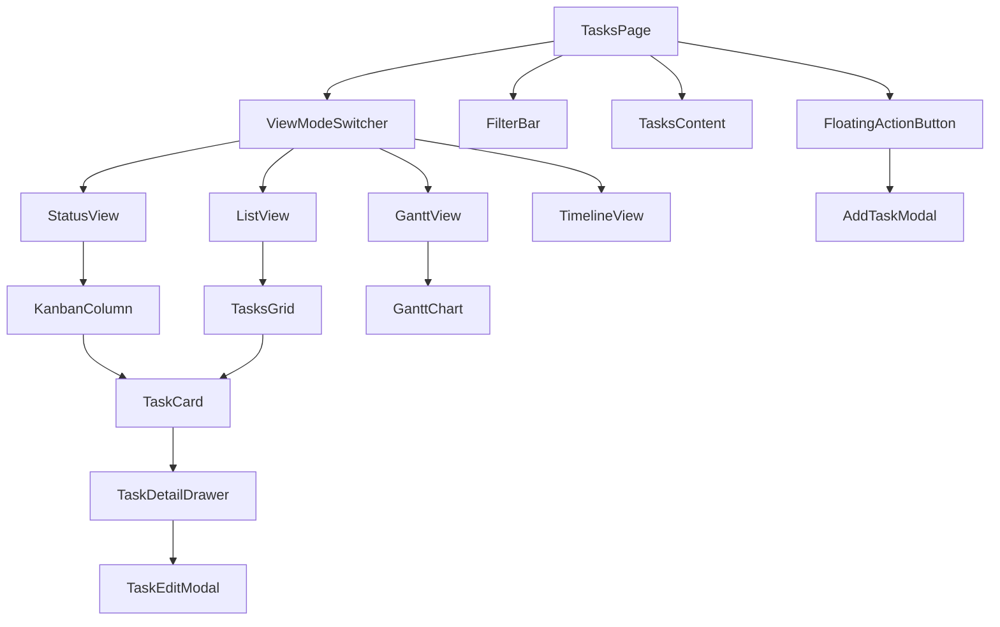
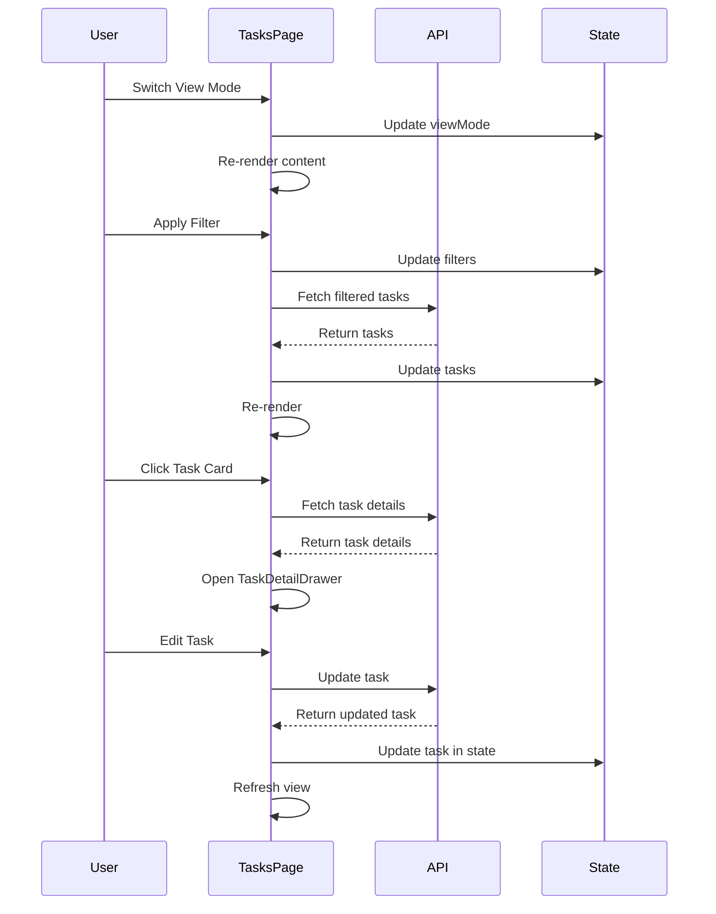

# Tasks UI Design & Architecture

## Overview

Giao diện quản lý tasks được thiết kế với 4 view modes chính, hệ thống filter mạnh mẽ, và các components tái sử dụng để tạo trải nghiệm người dùng tốt nhất.

## Architecture

### Component Hierarchy

```
TasksPage
├── TasksHeader
│   ├── ViewModeSwitcher (Status/List/Gantt/Timeline)
│   ├── FilterBar
│   │   ├── QuickFilters
│   │   ├── ActiveFilters (chips)
│   │   └── AdvancedFilterButton
│   └── SearchBar
├── TasksContent
│   ├── StatusView (Kanban)
│   │   ├── KanbanColumn (x4: To Do, In Progress, Done, Blocked)
│   │   └── TaskCard (draggable)
│   ├── ListView
│   │   ├── TasksGrid
│   │   └── TaskCard
│   ├── GanttView
│   │   └── GanttChart
│   └── TimelineView
│       └── TimelineChart
├── TaskDetailDrawer
│   ├── TaskDetailHeader
│   ├── TaskDetailBody
│   │   ├── DescriptionSection
│   │   ├── MetadataSection
│   │   ├── SubtasksSection
│   │   ├── CommentsSection
│   │   ├── AttachmentsSection
│   │   ├── ActivityLogSection
│   │   └── DependenciesSection
│   └── TaskDetailActions
├── TaskEditModal
│   └── TaskForm
└── FloatingActionButton (Add Task)
```

## View Modes

### 1. Status View (Kanban Board)

**Layout:**
```
┌─────────────────────────────────────────────────────────┐
│  [To Do] [In Progress] [Done] [Blocked]                 │
│  ┌──────┐ ┌──────────┐ ┌─────┐ ┌────────┐             │
│  │ (5)  │ │   (3)    │ │ (2) │ │  (1)   │             │
│  ├──────┤ ├──────────┤ ├─────┤ ├────────┤             │
│  │ Card │ │  Card    │ │Card │ │ Card   │             │
│  │ Card │ │  Card    │ │Card │ │        │             │
│  │ Card │ │  Card    │ │     │ │        │             │
│  └──────┘ └──────────┘ └─────┘ └────────┘             │
└─────────────────────────────────────────────────────────┘
```

**Features:**
- 4 columns: To Do, In Progress, Done, Blocked
- Drag & drop giữa các columns
- Count badge trên mỗi column header
- Color-coded columns
- Mobile: Tabs thay vì columns

**Component: StatusView**
```javascript
<StatusView>
  <KanbanColumn status="todo" tasks={todoTasks} />
  <KanbanColumn status="in-progress" tasks={inProgressTasks} />
  <KanbanColumn status="done" tasks={doneTasks} />
  <KanbanColumn status="blocked" tasks={blockedTasks} />
</StatusView>
```

### 2. List View

**Layout:**
```
┌─────────────────────────────────────────────────────────┐
│  [Sort: Deadline ▼] [View: Compact/Expanded]           │
│  ┌──────────┐ ┌──────────┐ ┌──────────┐               │
│  │ TaskCard │ │ TaskCard │ │ TaskCard │               │
│  └──────────┘ └──────────┘ └──────────┘               │
│  ┌──────────┐ ┌──────────┐ ┌──────────┐               │
│  │ TaskCard │ │ TaskCard │ │ TaskCard │               │
│  └──────────┘ └──────────┘ └──────────┘               │
└─────────────────────────────────────────────────────────┘
```

**Features:**
- Grid layout (responsive: 1 col mobile, 2-3 cols desktop)
- Sortable columns
- Compact/Expanded view toggle
- Infinite scroll hoặc pagination

**Component: ListView**
```javascript
<ListView>
  <TasksGrid tasks={filteredTasks} layout="grid" />
</ListView>
```

### 3. Gantt Timeline View

**Layout:**
```
┌─────────────────────────────────────────────────────────┐
│  [Zoom: Day/Week/Month] [Group: Project/Assignee]      │
│  ┌───────────────────────────────────────────────────┐ │
│  │ Project A                                         │ │
│  │   ├─ Task 1  [████████████░░░░]                  │ │
│  │   └─ Task 2        [████████████]                │ │
│  │ Project B                                         │ │
│  │   ├─ Task 3  [████████████████]                  │ │
│  │   └─ Task 4           [████░░░░░░]               │ │
│  └───────────────────────────────────────────────────┘ │
│  Jan 1    Jan 8    Jan 15   Jan 22   Jan 29           │
└─────────────────────────────────────────────────────────┘
```

**Features:**
- Timeline với start date và due date
- Group by project hoặc assignee
- Zoom levels: Day, Week, Month
- Drag để thay đổi dates
- Highlight overdue tasks
- Milestone markers

**Component: GanttView**
```javascript
<GanttView>
  <GanttChart 
    tasks={filteredTasks} 
    groupBy="project"
    zoom="week"
  />
</GanttView>
```

### 4. Timeline View (Alternative)

**Layout:**
```
┌─────────────────────────────────────────────────────────┐
│  [Today]                                                │
│  ┌───────────────────────────────────────────────────┐ │
│  │ Mon, Jan 1                                        │ │
│  │   ├─ Task 1 (High Priority)                      │ │
│  │   └─ Task 2                                       │ │
│  │ Tue, Jan 2                                        │ │
│  │   ├─ Task 3                                       │ │
│  │   └─ Task 4 (Overdue)                            │ │
│  └───────────────────────────────────────────────────┘ │
└─────────────────────────────────────────────────────────┘
```

**Features:**
- Chronological timeline
- Group by date
- Visual indicators cho priority và status
- Quick actions trên mỗi task

## Task Card Component

### Card Structure

```
┌─────────────────────────────────────┐
│ [High] Task Title            [⋮]    │ ← Header
├─────────────────────────────────────┤
│ Description preview text...         │
│                                     │
│ 👤 John Doe  📁 Project A           │ ← Body
│ 📅 Due: Jan 15  ⚠️ Overdue          │
│                                     │
│ [████████░░] 80%                    │ ← Progress
├─────────────────────────────────────┤
│ 💬 3  📎 2  🏷️ bug, urgent          │ ← Footer
└─────────────────────────────────────┘
```

### Card Variants

1. **Compact Card**: Minimal info, smaller size
2. **Standard Card**: Full info, default size
3. **Expanded Card**: All details visible

### Card Props

```typescript
interface TaskCardProps {
  task: Task;
  variant?: 'compact' | 'standard' | 'expanded';
  showActions?: boolean;
  draggable?: boolean;
  onClick?: (task: Task) => void;
}
```

## Filter System

### Filter Bar Layout

```
┌─────────────────────────────────────────────────────────┐
│ [Status: All ▼] [Priority: All ▼] [Assignee: All ▼]    │
│ [Project: All ▼] [Due: All ▼] [Clear All]              │
│                                                         │
│ Active: [To Do ×] [High ×] [John Doe ×]                │
└─────────────────────────────────────────────────────────┘
```

### Advanced Filter Modal

```
┌─────────────────────────────────────┐
│ Advanced Filters            [×]     │
├─────────────────────────────────────┤
│ Status:                             │
│ ☑ To Do  ☑ In Progress             │
│ ☑ Done   ☑ Blocked                 │
│                                     │
│ Priority:                           │
│ ☑ High  ☑ Medium  ☑ Low            │
│                                     │
│ Assignee:                           │
│ [Search users...]                   │
│ ☑ John Doe  ☑ Jane Smith           │
│                                     │
│ Due Date:                           │
│ [Start Date] [End Date]             │
│                                     │
│ [Apply] [Reset] [Save Preset]      │
└─────────────────────────────────────┘
```

## Task Detail Drawer

### Drawer Layout

```
┌─────────────────────────────────────┐
│ Task Title              [Edit] [×]  │ ← Header
├─────────────────────────────────────┤
│ [High Priority] [In Progress]       │
│                                     │
│ Description:                        │
│ ┌─────────────────────────────────┐ │
│ │ Full task description...        │ │
│ └─────────────────────────────────┘ │
│                                     │
│ Assignee: 👤 John Doe               │
│ Project: 📁 Project A               │
│ Due Date: 📅 Jan 15, 2025          │
│                                     │
│ Subtasks:                           │
│ ☑ Subtask 1                        │
│ ☐ Subtask 2                        │
│                                     │
│ Comments:                           │
│ ┌─────────────────────────────────┐ │
│ │ 💬 John: Great work!            │ │
│ │ 💬 Jane: Thanks!                │ │
│ └─────────────────────────────────┘ │
│                                     │
│ Attachments:                        │
│ 📎 document.pdf                     │
│                                     │
│ Activity Log:                       │
│ • Created by John on Jan 1         │
│ • Updated by Jane on Jan 5         │
└─────────────────────────────────────┘
```

## Task Form (Add/Edit)

### Form Layout

```
┌─────────────────────────────────────┐
│ Add Task                    [×]     │
├─────────────────────────────────────┤
│ Title *                             │
│ ┌─────────────────────────────────┐ │
│ │ Enter task title...             │ │
│ └─────────────────────────────────┘ │
│                                     │
│ Description                         │
│ ┌─────────────────────────────────┐ │
│ │ Enter description...            │ │
│ │                                 │ │
│ └─────────────────────────────────┘ │
│                                     │
│ Status: [In Progress ▼]             │
│ Priority: [High ▼]                  │
│ Assignee: [Select users... ▼]       │
│ Project: [Select project... ▼]      │
│ Due Date: [Jan 15, 2025]            │
│                                     │
│ Subtasks:                           │
│ ┌─────────────────────────────────┐ │
│ │ ☐ Subtask 1            [×]      │ │
│ │ ☐ Subtask 2            [×]      │ │
│ │ [+ Add Subtask]                 │ │
│ └─────────────────────────────────┘ │
│                                     │
│ [Cancel] [Save Task]                │
└─────────────────────────────────────┘
```

## Color Scheme

### Status Colors
- **To Do**: Gray (#6B7280)
- **In Progress**: Blue (#3B82F6)
- **Done**: Green (#10B981)
- **Blocked**: Red (#EF4444)

### Priority Colors
- **High**: Red (#EF4444)
- **Medium**: Yellow (#F59E0B)
- **Low**: Green (#10B981)

### UI Colors
- **Background**: White (#FFFFFF)
- **Card Background**: White (#FFFFFF)
- **Border**: Gray-200 (#E5E7EB)
- **Text Primary**: Gray-900 (#111827)
- **Text Secondary**: Gray-600 (#4B5563)

## Typography

- **Page Title**: 24px, Bold
- **Section Headers**: 18px, Semibold
- **Task Title**: 16px, Semibold
- **Body Text**: 14px, Regular
- **Caption**: 12px, Regular

## Spacing

- **Card Padding**: 16px
- **Card Gap**: 16px
- **Section Spacing**: 24px
- **Element Spacing**: 8px

## Responsive Breakpoints

- **Mobile**: < 768px
- **Tablet**: 768px - 1024px
- **Desktop**: > 1024px

### Mobile Adaptations

1. **Kanban View**: 
   - Chuyển thành tabs thay vì columns
   - Swipe để chuyển tab

2. **List View**:
   - 1 column layout
   - Compact cards mặc định

3. **Gantt View**:
   - Horizontal scroll
   - Simplified timeline

4. **Filter Bar**:
   - Collapsible
   - Bottom sheet cho advanced filters

5. **Task Detail**:
   - Full screen modal
   - Bottom sheet style

## Interactions

### Drag & Drop
- **Visual Feedback**: Ghost card khi drag
- **Drop Zones**: Highlight columns khi hover
- **Animation**: Smooth transition khi drop

### Hover States
- **Cards**: Subtle shadow và scale
- **Buttons**: Background color change
- **Links**: Underline

### Loading States
- **Skeleton Loaders**: Cho cards và lists
- **Spinners**: Cho actions
- **Progress Bars**: Cho saves

## Accessibility

### Keyboard Navigation
- **Tab**: Navigate between elements
- **Enter/Space**: Activate buttons
- **Arrow Keys**: Navigate cards
- **Esc**: Close modals/drawers

### Screen Reader Support
- **ARIA Labels**: Tất cả interactive elements
- **Role Attributes**: Proper roles
- **Live Regions**: Cho dynamic updates

## Performance Considerations

### Lazy Loading
- Load tasks khi scroll
- Load Gantt data khi switch view
- Load detail data khi mở drawer

### Virtualization
- Virtual scrolling cho large lists
- Virtual rendering cho Gantt chart

### Caching
- Cache filtered results
- Cache task details
- Cache user/project lists

## Component Specifications

### TaskCard Component

```typescript
interface TaskCardProps {
  task: {
    id: number;
    title: string;
    description?: string;
    status: 'todo' | 'in-progress' | 'done' | 'blocked';
    priority: 'high' | 'medium' | 'low';
    assignee?: User;
    project?: Project;
    dueDate?: Date;
    progress?: number;
    commentsCount?: number;
    attachmentsCount?: number;
    tags?: string[];
  };
  variant?: 'compact' | 'standard' | 'expanded';
  draggable?: boolean;
  onClick?: () => void;
  onStatusChange?: (status: string) => void;
}
```

### FilterBar Component

```typescript
interface FilterBarProps {
  filters: TaskFilters;
  onFilterChange: (filters: TaskFilters) => void;
  onClearFilters: () => void;
  savedPresets?: FilterPreset[];
}

interface TaskFilters {
  status?: string[];
  priority?: string[];
  assignee?: number[];
  project?: number[];
  dueDate?: {
    start?: Date;
    end?: Date;
    range?: 'today' | 'this-week' | 'this-month' | 'overdue';
  };
  search?: string;
}
```

## Mermaid Diagrams

### Component Flow



### Data Flow



## Implementation Notes

### Libraries to Use

1. **Gantt Chart**: Frappe Gantt (lightweight, easy to customize)
2. **Drag & Drop**: SortableJS (powerful, touch support)
3. **Date Picker**: Flatpickr (lightweight, customizable)
4. **Rich Text Editor**: Quill (lightweight, modern)

### State Management

- Use React-like state management hoặc vanilla JS với state object
- Centralized state cho tasks, filters, view mode
- Optimistic updates cho better UX

### API Integration

- Use existing `/api/tasks-enhanced` endpoints
- Add new endpoints nếu cần:
  - `GET /api/tasks-enhanced/gantt` - Gantt data
  - `POST /api/tasks-enhanced/bulk-update` - Bulk operations


